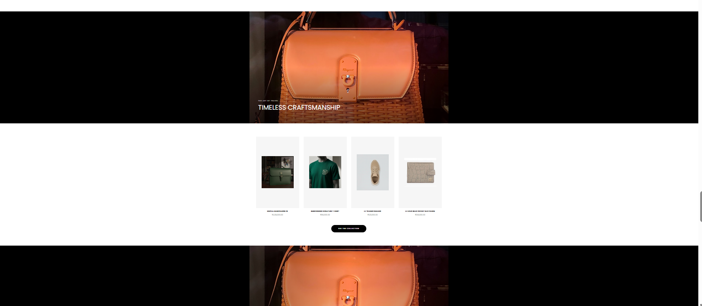

# Murgdur Luxury Video Content Plan

## 🎬 AI-Generated Video Poster/Thumbnail

**Since AI image generation is temporarily unavailable**, here's the prompt to generate the luxury video poster when the service is back:

### Image Prompt:
```
Cinematic luxury fashion video still, elegant Murgdur crown logo embossed on premium black leather surface, dramatic studio lighting with golden highlights, red velvet fabric draping in background, ultra premium brand photography, Louis Vuitton style cinematography, 8K quality, moody atmospheric lighting, professional luxury brand video aesthetic
```

### Alternative Prompt (Product Focus):
```
Premium luxury handbag showcase, Murgdur gold crown logo embossed on black leather, red sphere accent piece, dramatic gradient lighting from dark to warm gold, cinematic fashion photography, Louis Vuitton promotional video style, ultra-premium quality, 8K resolution
```

---

## 📹 Video Section Details

### Current Video:
- **Source:** Pexels free stock video (fashion themed)
- **URL:** `https://videos.pexels.com/video-files/3205903/3205903-hd_1920_1080_25fps.mp4`

### Recommended Custom Video:
Create a **30-60 second luxury brand video** featuring:
1. **Opening shot:** Murgdur logo reveal with golden animation
2. **Product showcase:** Slow-motion shots of:
   - Leather handbags being crafted
   - Gold crown logo embossing process
   - Model wearing royal attire
   - Close-ups of premium leather texture
3. **Lighting:** Dramatic studio lighting (dark to gold gradient)
4. **Music:** Elegant, orchestral background music
5. **Ending:** Murgdur logo with tagline "Royal Heritage & Luxury"

---

## 🎨 Video Specifications

### Technical Requirements:
- **Resolution:** 1920x1080 (Full HD) minimum
- **Format:** MP4 (H.264 codec)
- **Duration:** 30-60 seconds
- **Aspect Ratio:** 16:9
- **Frame Rate:** 24-30 fps
- **Audio:** Optional (video plays muted with autoplay)

### Visual Style:
- **Color Palette:** Black, gold (#D4AF37), deep red accents
- **Mood:** Luxurious, elegant, cinematic
- **Inspiration:** Louis Vuitton, Hermès, Gucci promotional videos
- **Camera Movement:** Slow, smooth tracking shots and close-ups

---

## 📝 Video Section Content

### Current Overlay Text:
- **Heading:** "The Royal Chronicle"
- **CTA:** "Watch the Film"
- **Link:** `/royal-collection`

### Suggested Updates:
```jsx
Heading: "Heritage Redefined"
or: "The Art of Luxury"
or: "Crafted for Royalty"

CTA: "Explore the Collection"
or: "Witness the Craft"
```

---

## 🎭 Placeholder Options (Until Custom Video)

### Option 1: High-Quality Stock Video
- **Pexels:** Search for "luxury leather goods"
- **Unsplash:** Premium fashion photography
- **Pixabay:** Free luxury brand videos

### Option 2: Static Image with Animation
- Use the AI-generated poster image
- Add CSS animations (zoom, parallax)
- Create cinematic feel with overlay effects

### Option 3: Image Slider
- Create a slideshow of:
  - Product close-ups
  - Craftsmanship shots
  - Model wearing products
  - Logo animations

---

## 🔧 Implementation Steps

1. **Generate Video Poster:**
   - Wait for AI service to be available
   - Use the prompts above
   - Save as: `murgdur_video_poster.jpg`

2. **Place in Public Folder:**
   ```
   /public/images/murgdur_video_poster.jpg
   ```

3. **Update Video Component:**
   ```jsx
   poster="/images/murgdur_video_poster.jpg"
   ```

4. **Optional - Upload Custom Video:**
   - Record or commission professional video
   - Upload to `/public/videos/murgdur_hero.mp4`
   - Update src in Home.jsx

---

## 🎯 Current Status

✅ **Video Section:** Properly placed after product sections  
⏳ **AI Image Generation:** Temporarily unavailable  
📝 **Video Poster Prompt:** Ready to generate  
🎬 **Custom Video:** Needs creation/upload  

---

*Generated: February 15, 2026*  
*Project: Murgdur Royal Heritage Website*
